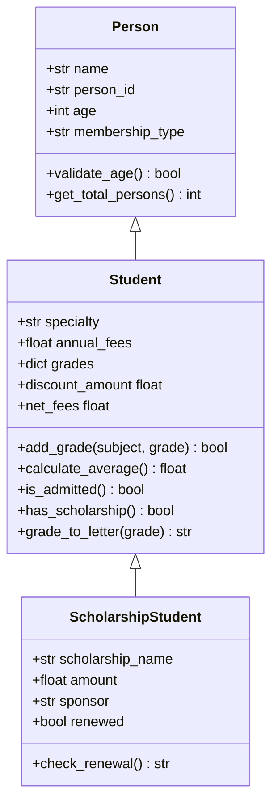

<p align="center">
  
  
  
  
</p>

<h1 align="center">🎓 Smart Student Management System</h1>

<p align="center">
  <strong>A comprehensive, terminal-based student management application built with Python OOP principles.</strong><br>
  <em>PRG1406 — Group Assignment 1</em>
</p>

---
## Group 7 – Members

- MEDA Franck
- OUADRAOGO Landry
- BASSINGA Keya
- YELEMOU Josias
- CONGO Anifatou

## 📋 Table of Contents

- [Overview](#-overview)
- [Features](#-features)
- [Architecture](#-architecture)
- [Installation](#-installation)
- [Usage](#-usage)
- [Class Hierarchy](#-class-hierarchy)
- [Screenshots](#-screenshots)
- [Contributors](#-contributors)
- [License](#-license)

---

## 🔍 Overview

The **Smart Student Management System** is a fully interactive, terminal-based application designed to manage student records efficiently. Built entirely in Python using Object-Oriented Programming (OOP) principles, it features a rich CLI experience with ANSI-colored output, step-by-step forms with back navigation, real-time grade calculations, and a comprehensive financial summary system.

---

## ✨ Features

| Feature | Description |
|---------|-------------|
| 📝 **Step-by-Step Registration** | Guided multi-step form with back navigation (type `0` to go back) |
| 🎨 **Rich Terminal UI** | ANSI color-coded output with styled cards, tables, and status indicators |
| 📊 **Grade Management** | Add, edit, and delete grades with automatic letter grade conversion |
| 💰 **Financial Calculations** | Automatic tuition fee discount based on academic performance & membership |
| 🏆 **Scholarship Tracking** | Dedicated scholarship student type with renewal logic |
| 🔄 **Edit After Save** | Full editing capability for all student fields post-registration |
| 📈 **Global Statistics** | Overview of all registered students with rankings |
| ✅ **Input Validation** | Robust validation on every input field with helpful error messages |
| 🔀 **Student Comparison** | Compare two students side-by-side by academic performance |
| 👀 **Preview Before Save** | Review all data before confirming registration |

---

## 🏗 Architecture

The project follows a clean **OOP architecture** with inheritance and polymorphism:

```
┌──────────────────────────────────────────────────────┐
│                    Person (Base)                     │
│  ├── name, person_id, age, membership_type           │
│  ├── __str__, __repr__, __eq__                       │
│  ├── @staticmethod validate_age()                    │
│  └── @classmethod get_total_persons()                │
├──────────────────────────────────────────────────────┤
│                 Student (Child)                      │
│  ├── specialty, annual_fees, grades{}                │
│  ├── __str__, __len__, __lt__, __add__               │
│  ├── calculate_average(), is_admitted()              │
│  ├── @property discount_amount, net_fees             │
│  └── @staticmethod grade_to_letter()                 │
├──────────────────────────────────────────────────────┤
│           ScholarshipStudent (Grandchild)            │
│  ├── scholarship_name, amount, sponsor, renewed      │
│  └── check_renewal()                                 │
└──────────────────────────────────────────────────────┘
```

---

## 🚀 Installation

### Prerequisites

- **Python 3.6+** installed on your system
- A terminal that supports ANSI color codes (most modern terminals)

### Steps

```bash
# 1. Clone the repository
git clone https://github.com/Franckmeda114/smart-student-management-system.git

# 2. Navigate to the project directory
cd smart-student-management-system

# 3. Run the application
python student_management.py
```

> **Note:** No external dependencies are required. The application uses only Python's standard library.

---

## 🎮 Usage

### Main Menu

When you launch the application, you'll see the main menu with 7 options:

```
  ╔══════════════════════════════════════════════════╗
  ║     SMART STUDENT MANAGEMENT SYSTEM             ║
  ║     PRG1406 — Group Assignment 1                ║
  ╚══════════════════════════════════════════════════╝

  ── MAIN MENU ────────────────────────────────────────
  1  →  Register a new student
  2  →  View all students
  3  →  View a student's record
  4  →  Edit an existing student
  5  →  Compare two students
  6  →  Global statistics
  7  →  Exit
```

### Registration Flow

The registration process is a **7-step guided form**:

1. **Student ID** — Unique identifier
2. **Full Name** — Student's complete name
3. **Age** — Between 15 and 80 (validated)
4. **Membership Type** — None, Student Club, Library, or Other
5. **Program / Specialty** — Academic program
6. **Annual Fees** — Tuition amount in FCFA
7. **Student Type** — Regular or Scholarship

> 💡 **Tip:** Type `0` at any step to go back to the previous one!

### Grading System

| Grade Range | Letter | Status |
|:-----------:|:------:|:------:|
| 18 – 20     | A+     | 🟢 Excellent |
| 16 – 17.99  | A      | 🟢 Very Good |
| 14 – 15.99  | B      | 🟢 Good |
| 12 – 13.99  | C      | 🟡 Satisfactory |
| 10 – 11.99  | D      | 🟡 Passing |
| 0 – 9.99    | F      | 🔴 Failing |

### Financial Discounts

| Condition | Discount Rate |
|-----------|:------------:|
| Scholarship eligible (avg ≥ 14) | **50%** |
| Admitted (avg ≥ 10) | **20%** |
| Membership bonus | **+10%** |
| Maximum discount cap | **90%** |

---

## 🏛 Class Hierarchy



---

## 🧩 OOP Concepts Demonstrated

| Concept | Implementation |
|---------|---------------|
| **Encapsulation** | Data attributes with controlled access via methods |
| **Inheritance** | `Person` → `Student` → `ScholarshipStudent` hierarchy |
| **Polymorphism** | Overridden `__str__` methods for different display formats |
| **Magic Methods** | `__str__`, `__repr__`, `__eq__`, `__lt__`, `__add__`, `__len__`, `__del__` |
| **Decorators** | `@staticmethod`, `@classmethod`, `@property` |
| **Class Variables** | `total_persons`, `ADMISSION_THRESHOLD`, `

## 📄 License

This project is licensed under the **MIT License** — see the [LICENSE](LICENSE) file for details.

---

<p align="center">
  <strong>Made with ❤️ for PRG1406</strong><br>
  <em>Smart Student Management System — 2026</em>
</p>
